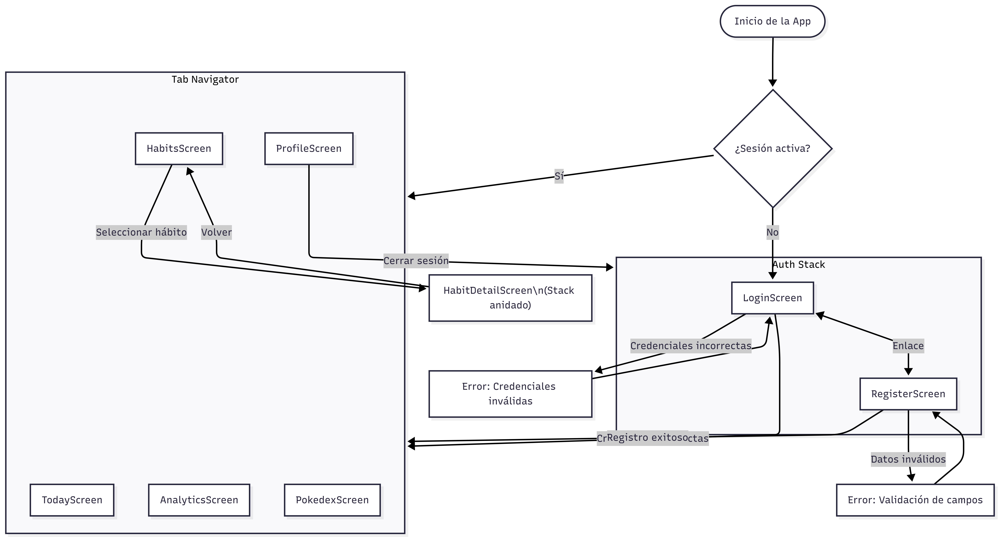

# Habidex

Aplicación móvil de seguimiento y constancia de hábitos con gamificación basada en Pokémon.

## Stack

- **Frontend:** Expo Go + React Native + TypeScript
- **Backend:** Node.js + Express
- **Base de datos:** Supabase (PostgreSQL)
- **Auth:** Supabase Auth (email/password + JWT)
- **Gamificación:** PokéAPI (151 Pokémon — Gen 1)

## Documentación

- [Diseño y especificación](docs/superpowers/specs/2026-03-24-habitos-pokemon-design.md)
- [Plan de implementación](docs/superpowers/plans/2026-03-24-habitos-pokemon.md)
- [Levantamiento de requerimientos](docs/Levantamiento-Requerimientos.pdf)

## Flujo de navegación

